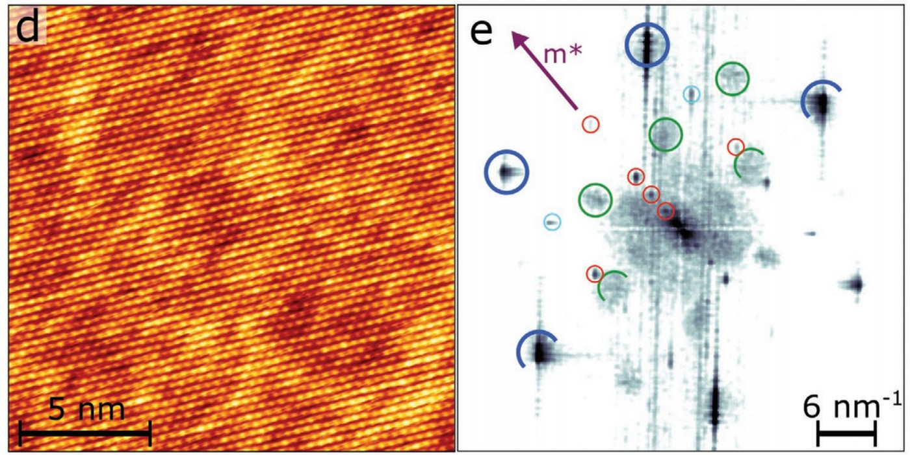
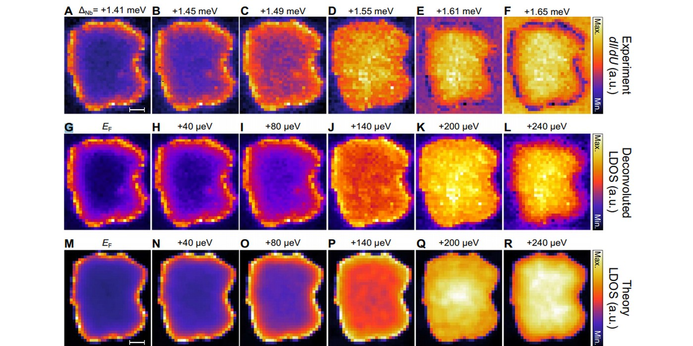
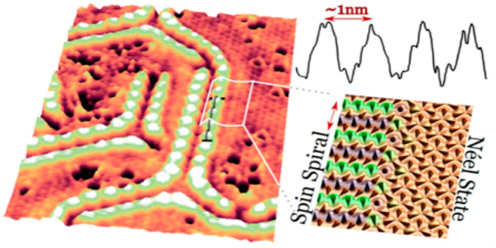

---
hide:
  - toc
---

# Welcome to Alexandra Palacio Morales' Personal Website

<!-- Swiper HTML -->

  

    

    

    

  

  <!-- Pagination dots -->
  

<!-- Initialize Swiper -->

I am an Associate Professor at [University Paris-Saclay](https://www.universite-paris-saclay.fr/) working at [Laboratoire de Physique des Solides](https://www.lps.u-psud.fr/?lang=fr) in the team [Nanostructures at the NanoSecond](https://equipes.lps.u-psud.fr/ns2/). 
My research focuses on correlations and dynamics at the atomic scale of quantum materials.

::timeline::

- title: Associate Professor
  sub_title: "2019–Present"

  content: |
    [University Paris-Saclay](https://www.universite-paris-saclay.fr/)

	 
	
    **Committee Services**  
	

    &#x2022 2023–2027 Appointed member, [CNU (Conseil national des universités)](https://conseil-national-des-universites.fr/cnu/) 
    &#x2022 2022–2026 Elected member, [CCUPS  (Commissions Consultatives de l'Université Paris-Saclay)](https://www.phys.universite-paris-saclay.fr/ccsu-2/)
	
	
	
    **Leaves** 

    
      2024 · Maternity leave
      2021 · Maternity leave
    

- title: Postdoctoral Researcher
  sub_title: 2018–2019
  content: Sorbonne University (INSP), [T. Cren’s group](https://w3.insp.upmc.fr/recherche-2/equipes-de-recherche/spectroscopie-des-nouveaux-etats-quantiques/)

- title: Postdoctoral Researcher
  sub_title: 2017–2018
  content: Hamburg University, [Prof. Wiesendanger’s group](http://www.nanoscience.de/HTML/index.html) — ASTONISH ERC

- title: Alexander von Humboldt [Postdoctoral Research Fellow](https://www.humboldt-foundation.de/en/)
  sub_title: 2015–2017
  content: Hamburg University

- title: PhD
  sub_title: 2011–2014
  content: University Grenoble Alpes ([CEA/Imapec Team](https://www.pheliqs.fr/Pages/Imapec/Presentation.aspx))
::/timeline::

---

